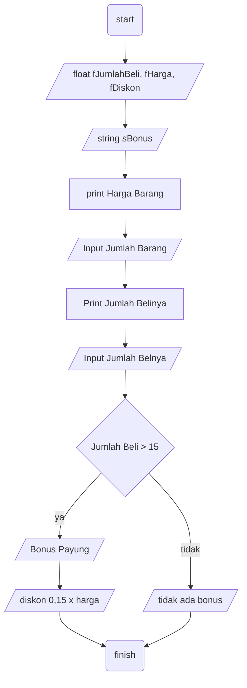

```mermaid
    flowchart TD;
    A(start) --> B[/float fJumlahBeli, fHarga, fDiskon/];
    B --> C[/string sBonus/];
    C --> D[print Harga Barang];
    D --> E[/Input Jumlah Barang/];
    E --> F[Print Jumlah Belinya];
    F --> G[/Input Jumlah Belnya/];
    G --> H{Jumlah Beli > 15};
    H --ya--> I[/Bonus Payung/];
    I --> J[/diskon 0,15 x harga/];
    H --tidak--> K[/tidak ada bonus/];
    J --> 0(finish)
    K --> 0

```